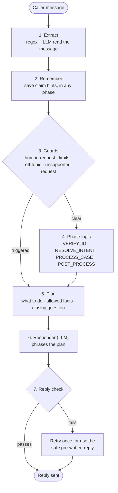

# Architecture

**Code for workflow; LLM for conversation.** The LLM reads the
caller's messages and phrases replies. Code decides everything else: the phase,
whether the caller is verified, which claim facts may be shared, and the question
the caller must answer next. Every reply is checked before it is sent.

## How one message is handled

1. **Extract.** Regex catches strictly formatted values (dates, phone, email, SSN
   last 4, claim IDs) even if the model fails. The LLM reads everything else: names,
   intent, claim hints, emotion, off-topic. Imperfect model output goes through a
   parser fallback chain; a malformed field is dropped, never guessed.
2. **Remember.** Anything useful is stored whenever it's said. "My denied
   healthcare claim from January" during verification is used right after it.
3. **Guards** apply in every phase: a request for a human, the 3-strike limits
   (failed verification, frustration/anger/refusal, off-topic), and requests the
   agent can't fulfil (offer a human instead).
4. **Phase logic.** Only code changes the phase, and it won't leave VERIFY_ID until
   3 of 5 identity fields match one record. The rules are in [SOP.md](SOP.md).
5. **Plan.** What the reply must do, the only claim facts the LLM may use (none
   before verification), a safe pre-written reply, and the closing question, which
   code appends word for word so every "yes" or "no" answers the right question.
6. **Responder.** The LLM turns the plan into a natural reply, with tone matched
   to the caller's emotion.
7. **Reply check.** Every claim ID, amount and date must come from the allowed
   facts; no claimed transfers or emails that didn't happen; only the verified
   customer's name; no comments on feelings the caller didn't express. A wrong name
   or unprompted empathy gets one retry; anything else gets the safe reply.

Every turn is logged (identity values masked) and shown in the UI's **Trace** tab.
